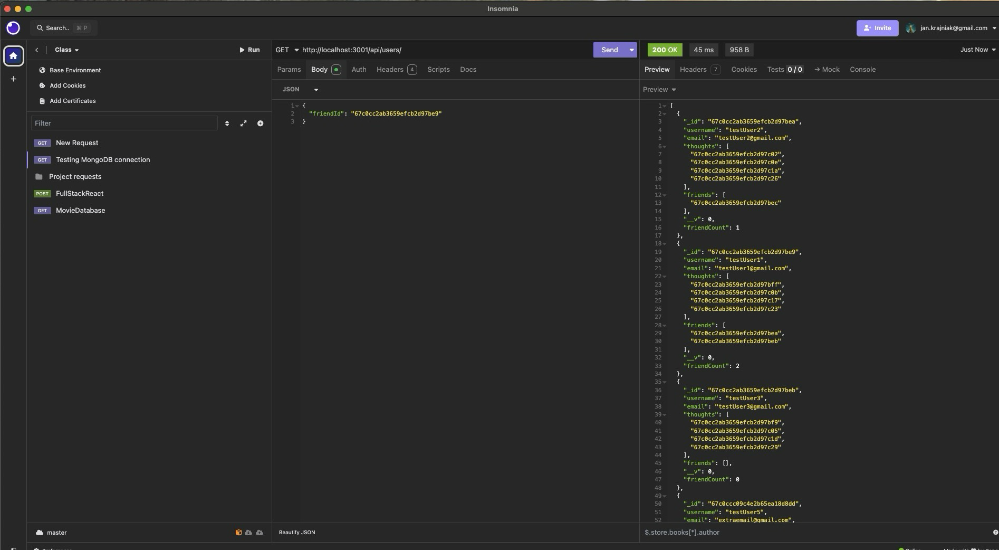

# socialDB

## Table of Contents
- [Descriptionn](#description)
- [Installation Instructions](#installation-instructions)
- [How to Use the App](#how-to-use-the-app)
- [Contribution Guidelines](#contribution-guidelines)
- [Test Instrustions](#test-instructions)
- [Questions](#questions)

## Description
- This project is noSQL database for a social network using mongoDB and mongoose. It is a demonstration of the API and can be interacted with using Insomnia or Postman. 
- The app apps can be used to create a user (username, email), update and delete the user. The app also allows other users to be associated as friends to any existing user, and to keep a history of thoughts the user posted.
- When a user is deleted, all thoughts the user posted are deleted as well
- Thoughts can additionally have reactions, which can be created or deleted

## Installation Instructions
- The repository contains all the files required for installing and running the app. Upon cloning the repository, run "npm install" to install all the required packages.
- Run "npm run build" to transpile the TS files and create a dist folder. 
- Run npm run seed to pre-seed the database with users and thoughts.
- Run "npm run start" to initialize the server
- The server is currently listening on localhost:3001
- Since this app is interacting with mongoDB, please make sure you have mongoDB installed and running prior to using the app

## How to Use the App
- The app can be used to log activities of users on a social network. New users can be created, each user can have friends associated with them, and each user can post a thought, to which other users can react.

## Contribution Guidelines
- The original author of this code is Jan Krajniak. Please provide credit when re-using code.

## Test Instructions
- N/A

## Questions
- My GitHub username: jankrajniak
- My email address: jan.krajniak@gmail.com
- Additional instructions on how to contact me:
  - If you would like to contact me, please email me at the above email address

## License
- This project is licensed under the MIT license: 

## App screenshots

## Link to video demonstration
https://drive.google.com/file/d/1lRa7zRog-IaYEGTVfgQEYaR9mDW4v2at/view?usp=sharing
